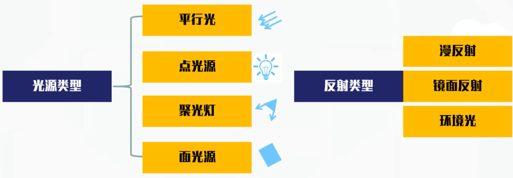
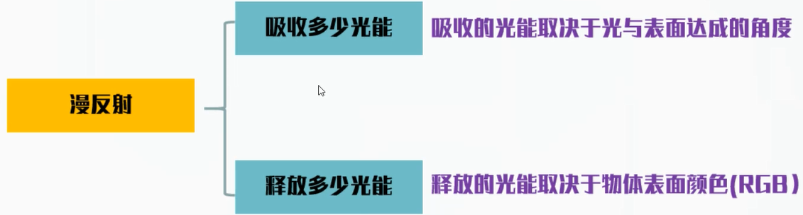
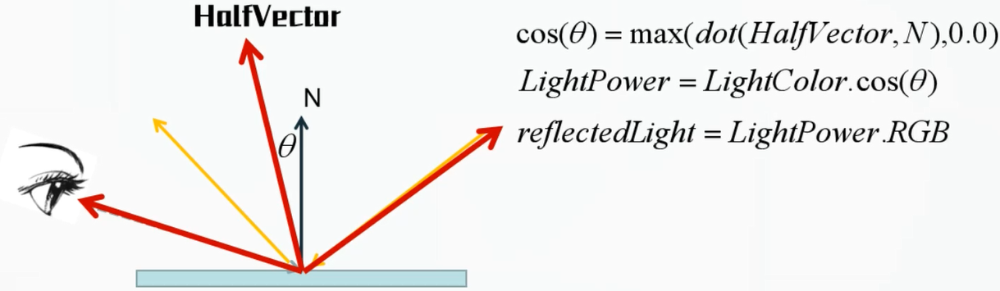
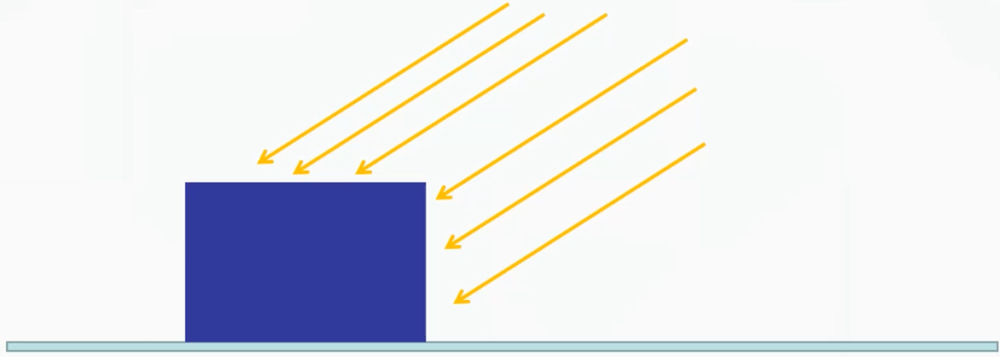
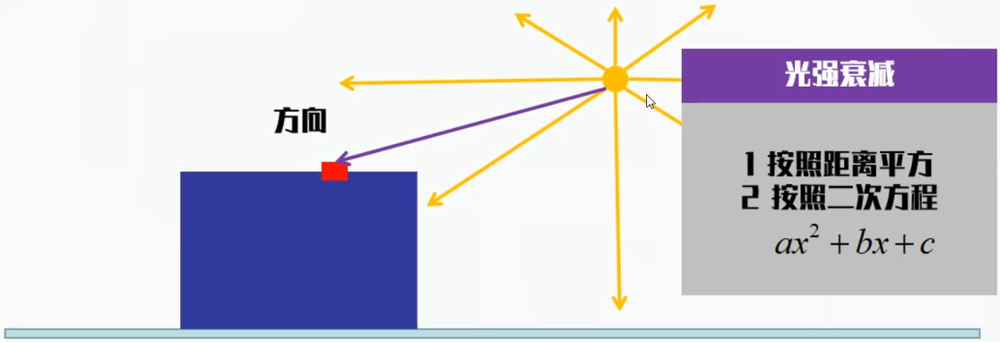
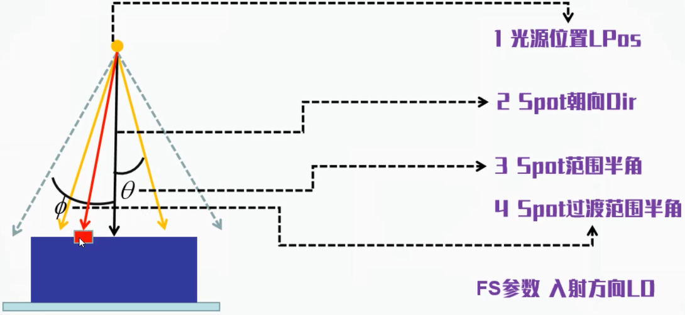
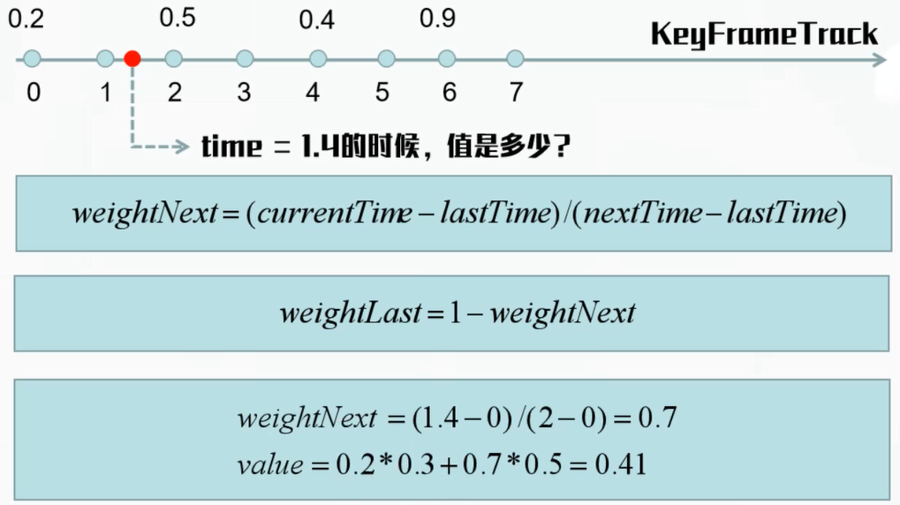
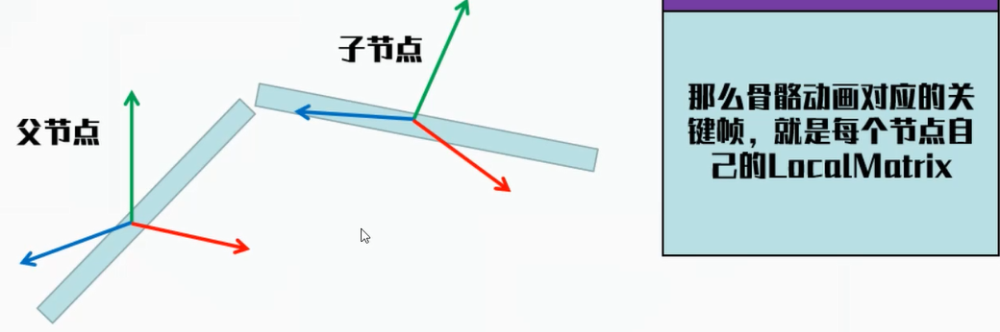
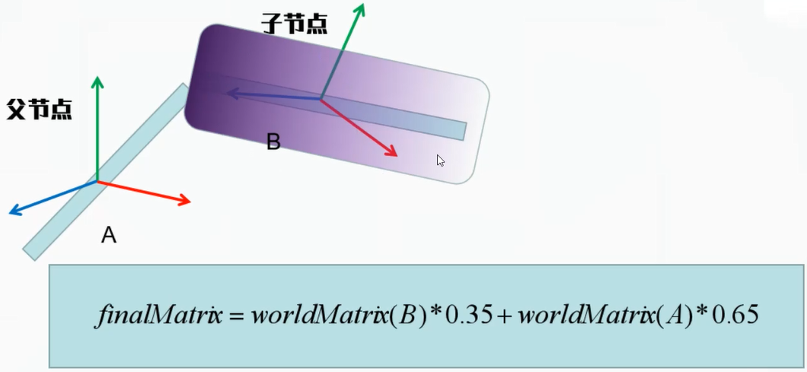

# 渲染基础

## 顶点与几何

**Attribute**：顶点上的所有属性(位置、颜色)，都被称为Attribute

**Mesh**：多个三角形构成的平面，立方体，球体，各类模型，都可以称之为一个Mesh

**Geometry**：描述一个Mesh的所有Attribute属性，并且提供各类附加函数以及数据功能

## 矩阵与变换

一律采用笛卡尔坐标系，即正交坐标系。分为左手跟右手坐标系，引擎中统一采用右手坐标系

**模型坐标系**：按照工程实际来讲，在建模的时候会有一个坐标系，所有的顶点在这个坐标系下都有自己的位置

- 如果把模型看成一个整体，那么建模完毕后，模型刚导入程序的时候，就是在(0, 0, 0)的位置

**世界坐标系**：把一个模型导入场景世界中，那么场景当中就必然会存在一个坐标系，这个就是世界坐标系

- 世界坐标系是唯一的，不可撼动的，所有场景当中的物体，都会最终计算出这个坐标系下的坐标

**坐标系的相对性**：一开始拿到的模型坐标，都是在模型坐标系当中的坐标，如果我们将整个模型坐标系旋转后移动，那么Mesh顶点的模型坐标系下的坐标不变，但是世界坐标系下的坐标就会发生变化

**MatrixTransform**：所有顶点的位置，都可以通过矩阵在世界坐标系进行移动、旋转、缩放

**ModelMatrix**：对模型坐标系施加的一系列平移、旋转、缩放等矩阵，相乘后综合起来，就是我们所说的模型变换矩阵。将物体的顶点坐标，由模型坐标系变换到自己父节点的坐标系内，如果没有父节点，则相当于变换到世界坐标系中

- 模型变换矩阵，就是将模型的顶点，从刚建模好的模型坐标系内，变换到世界坐标系下的矩阵。

**嵌套层级**：如果一个物体被"绑定"在另一个物体上，那么其模型矩阵，是将本物体顶点坐标，变换到父节点所在的坐标系内。

**WorldMatrix**：将物体以及其所有上层节点的ModelMatrix顺序相乘得到的矩阵，用于把物体的顶点直接变换到场景世界坐标系中。

**摄像机矩阵**：在将物体经过一系列变换，其顶点变为世界坐标系下的坐标后，我们需要将其转换到摄像机坐标系下，这样的坐标系称为ViewMatrix

- 摄像机坐标系建立在摄像机所在的位置上
- 摄像机默认看向其坐标系的负Z方向

我们把camera看作一个Object，那么它就会有自己的ModelMatrix以及WorldMatrix，WorldMatrix是将物体从本身的坐标系转化到世界坐标系当中。那么WorldMatrix的Inverse，肯定就是将某个坐标，从世界坐标系转换到摄像机的模型坐标系之中，就是我们需要的ViewMatrix

## 纹理贴图

**纹理坐标**：附着在顶点上的Attribute，用于标定本顶点位于纹理贴图上的位置

- 纹理坐标表示的是采样比例
- 纹理坐标乘以图片的宽高，来决定取得哪一个像素的颜色
- 三角形内部片元通过插值构成

**纹理的Warp**：repeat，mirror，clamp_to_edge

**纹理的Filter**：linear，nearest

### 纹理的其它作用

- 一个空白的纹理图片，可以作为一个RenderTarget的Attachment
- 纹理的RGB通道可以存储法线的信息，从而作为法线贴图，描述模型细节
- 纹理可以用其R通道，传入数值，表示物体每个片元着色的时候之镜面反射强度
- 一个物体可以贴多个纹理，互相之间RGB相乘，创造独特的效果
- 纹理可以作为阴影贴图，传入FragmentShader，制造阴影效果
- PBR下，纹理拥有更为复杂的用途

## Shader

现代GPU提供了一系列的可编程定制功能，来定义顶点数据处理、片元数据处理等功能，用于做这些处理的程序，即为Shader

### VertexShader

- 处理输入的顶点位置信息，通过MVP矩阵运算，得到NDC坐标
- 计算顶点的法线，对其进行变换，得到最终法线结果
- 计算光照所需的必要信息

### FragmentShader

- 处理纹理贴图的采样与加工

- 处理光照模型(PBR，LAMBERT等)

- 进行后处理加工

## 材质

一个物体本身的着色属性参数集合，诸如：是否参与光照计算、是否有贴图、是否拥有深度、是否透明、是否启用表面剔除等等。也会决定使用怎样的Shader来进行物体的绘制。

材质属于一个单独的Class，里面可以包含贴图的智能指针，关于管线当中透明渲染方式的设置，也应该归于材质类

深度是RenderTarget当中的一个图片，用于计算当前最接近摄像机的深度值

- 是否参与深度检测
- 是否写入深度缓存
- 深度如何对比

- 深度缓存使用怎样的默认值清理

材质当中也会进行光栅化阶段的参数设置

- 如何定义正面
- 渲染正面、背面、或者两面
- 顶点如何理解(三角形、线)

**Uniform和Attribute区别**：Attribute是随着顶点进入渲染管线，每个VS处理的顶点数据都不同，Uniform是对本次Draw操作的VS/FS都相同

## 光照

光源类型决定到达物体表面的光强度以及方向，反射类型决定物体收到光能后，如何给到屏幕像素一个最终颜色

### Diffuse Light(漫反射)

漫反射表达了光到达物体表面，被物体吸收之后，释放出来的光能(各个方向均相同)

**Lambert-Diffuse**：直接用光的颜色表示光能，与角度的余弦值相乘

### Specular Light(镜面反射)

镜面反射表达了光的一部分，到达物体表面后，被吸收，按照物体颜色被反射出来的光线，与光入射方向、物体法线方向、观察方向都有关系。

### 平行光

平行光特点是只有方向、光能描述等，比如太阳，十分巨大，在地球上看，就是只有方向的平行光。

### 点光源

点光源是指空间中一个点向四面八方发出光能，物体接受光照的方向取决于物体上照射点的位置以及光源的位置，强度取决于到光源的距离。

### 聚光灯

聚光灯属于能够限制光源范围的光，比如手电筒。它的重要属性是：

## 动画

动画其实就是物体在每一帧都会渐变的过程，通过每一帧移动或者变动一点而产生的连续变化的效果

如果要实现连续的动态动作记录，就需要记录所谓关键帧的信息

### 关键帧

在动画当中，记录在某个时刻，对象的某个动画相关的状态，比如动作、位置、颜色等

动画就是在关键帧当中根据时间过度的产物。

### 动画数据

一段动画必要记录的属性数据

- 关键数据帧
- 关键帧时间点
- 动画总时长

### 插值

- 线性插值-Linear
- 球面线性插值-Slerp
- 其它非线性插值

### 骨骼动画

**骨骼**：子节点依附于父节点，父节点的变动会带动子节点的变动。那么每一个节点的坐标系，就成为一根骨骼

**蒙皮**：每个Mesh的顶点，都会收到多根骨骼变换的影响，多根骨骼对其影响也都有对应权重

### 动画架构

#### 关键帧及插值(Key Frame Track)

负责完成关键帧数据的保存以及按照时间进行插值返回信息

不同的属性，可以采用不同的插值算法，Position与Scale使用线性插值，Rotation四元数采用球面线性插值

#### Animation Clip

表示模型的一个动作，比如走路、跑动、打拳等

#### Animation Action

表示对某个动作的控制，包括开始、停止、倍速播放等功能。同事负责与具体的模型Mesh相绑定